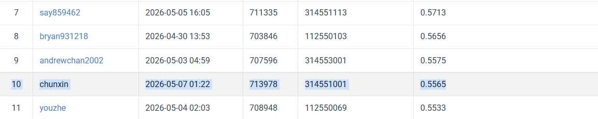

# NYCU VRDL 2026 Spring -- Homework 3 (Cell Instance Segmentation)

- **Student ID:** 314551001
- **Name:** Tan Chun-Xin
- **Public leaderboard score:** AP50 = **0.5565** (rank 10, 2026-05-07)

## Introduction

This repository implements an instance-segmentation pipeline for the
NYCU-VRDL-HW3 four-class cell-segmentation benchmark (209 train / 101
test images, .tif format, hidden-test metric AP50). The base detector is
Mask R-CNN with a ResNeXt-101-32x8d FPN backbone.
On top of the baseline we add three task-specific modifications:

1. **DCNv2** (modulated deformable convs) on res3--res5 -- adapts the
   3x3 receptive field to elongated / clustered cells.
2. **BCE + Dice hybrid mask loss** -- counters the foreground/background
   imbalance inside the 28x28 RoI window.
3. **PointRend mask head** -- produces a coarse 7x7 mask, then iteratively
   up-samples by querying a per-point MLP at the most uncertain
   boundary points (high-res masks only where they matter).

At inference we use multi-scale (768/1024/1280) + horizontal-flip TTA
and replace hard NMS with **Soft-NMS** (Gaussian decay, sigma=0.5).
The model trains in 30k iterations on a single GPU at FP16 and stays
under the 200M trainable-parameter budget (~109M).

The repo contains three configurations:

| Folder       | Recipe                                                      | Public AP50 |
|--------------|-------------------------------------------------------------|-------------|
| `code_v1/`   | Plain Mask R-CNN X-101 + multi-scale TTA + hard NMS         | 0.5516      |
| `code_v2/`   | `code_v1` + DCNv2 + BCE+Dice loss                           | 0.5549      |
| `best/`      | `code_v2` + PointRend mask head + Soft-NMS at inference     | **0.5565**  |

## Environment Setup

Tested on Python 3.10 + CUDA 12.1 + a single NVIDIA GPU with >=12 GB.

### 1. Create a clean virtual environment

```bash
conda create -n vrdl_hw3 python=3.10 -y
conda activate vrdl_hw3
```

### 2. Install PyTorch (CUDA 12.1 wheels)

```bash
pip install torch torchvision --index-url https://download.pytorch.org/whl/cu121
```

If you are on a different CUDA version, follow
<https://pytorch.org/get-started/locally/> for the matching wheel.

### 3. Install Detectron2 from source

```bash
pip install git+https://github.com/facebookresearch/detectron2.git
```

`best/` additionally needs the **PointRend project** which ships inside
the detectron2 source tree but is not installed by `pip`. Clone the
detectron2 repo locally so the project files are on disk:

```bash
git clone https://github.com/facebookresearch/detectron2.git ../detectron2
```

`best/train.py` and `best/inference.py` resolve the project at
`../detectron2/projects/PointRend/` and add it to `sys.path` at runtime.

### 4. Install the rest of the dependencies

```bash
pip install -r requirements.txt
```

### 5. Place the dataset

Unzip the official HW3 dataset so the layout is:

```
VRDL_HW3/
+- hw3-data-release/
|  +- train/
|  |  +- <sample_id>/image.tif
|  |  +- <sample_id>/class1.tif
|  |  +- ...
|  +- test_release/
|  |  +- <name>.tif
|  +- test_image_name_to_ids.json
+- best/
+- code_v1/
+- code_v2/
+- ...
```

## Usage

All three configurations follow the same pattern: edit the constants at
the top of `train.py` / `inference.py` if you need to (e.g. GPU index,
number of workers, output paths) -- the rest is single-file.

### Training

```bash
# Best model (DCNv2 + BCE+Dice + PointRend)
cd best
bash run_all.sh                    # downloads weights, trains, infers, plots

# Or individual steps:
python train.py                    # writes runs/<exp>/model_final.pth
python inference.py                # writes runs/<exp>/submit/submission.zip
python plots.py                    # writes runs/<exp>/figures/*.png
```

The same workflow applies to `code_v1/` and `code_v2/`. Each folder is
self-contained and writes to its own `runs/<exp_name>/` directory; they
do not interfere with each other.

### Inference / Submission

`inference.py` produces `runs/<exp>/submit/submission.zip` containing
`test-results.json` in the official Codabench RLE format. Upload the zip
directly via Codabench's "My Submissions" page.

### Reproducing the report figures

```bash
cd best
python plots.py
```

This regenerates all 11 figures (`figures/01_pr_curve.png`,
`02_per_class_ap.png`, ..., `11_lr_schedule.png`) plus a
`figures/summary.json` from the validation split.

## Performance Snapshot



| Metric                 | Local val | Public LB |
|------------------------|-----------|-----------|
| AP50                   | 0.789     | **0.5565**|
| mAP @[.5:.95]          | 0.362     | --        |
| AP75                   | 0.548     | --        |
| AP_small / medium / large | 0.430 / 0.443 / 0.353 | -- |
| Best F1 score threshold | 0.37     | --        |

## Notes

- All three folders are **single-file** (no CLI args). Edit the constants
  at the top of `train.py` / `inference.py` if you need to change paths
  or hyper-parameters.
- COCO-pretrained weights are downloaded automatically by `run_all.sh`
  on first run (~265 MB for the PointRend X-101 .pkl).
- `train.py` writes `split.json` so subsequent runs (validation,
  inference, plots) all use the same train/val partition.

## File Layout

```
VRDL_HW3/
+- 314551001_HW3.pdf       # Final report
+- 314551001_HW3.tex       # Report source (ECCV 2026 / LLNCS template)
+- README.md               # This file
+- requirements.txt        # Python dependencies
+- LeaderBoard.png         # Codabench public-leaderboard snapshot
+- figures/                # Report figures (plots.py output)
+- best/                   # Final submission (DCN + Dice + PointRend + Soft-NMS)
|  +- train.py
|  +- inference.py
|  +- plots.py             # Generates the report figures
|  +- visualize.py
|  +- run_all.sh
+- code_v1/                # Ablation v1 (plain Mask R-CNN X-101)
+- code_v2/                # Ablation v2 (v1 + DCNv2 + BCE+Dice)
```

## References

The report (`314551001_HW3.pdf`) cites all method references. Key papers:

- He, K. et al. *Mask R-CNN.* ICCV 2017.
- Xie, S. et al. *Aggregated residual transformations for deep neural networks.* CVPR 2017.
- Lin, T.-Y. et al. *Feature pyramid networks for object detection.* CVPR 2017.
- Zhu, X. et al. *Deformable ConvNets v2.* CVPR 2019.
- Kirillov, A. et al. *PointRend: image segmentation as rendering.* CVPR 2020.
- Milletari, F. et al. *V-Net.* 3DV 2016.
- Bodla, N. et al. *Soft-NMS.* ICCV 2017.
- Wu, Y. et al. *Detectron2.* <https://github.com/facebookresearch/detectron2> (2019).
